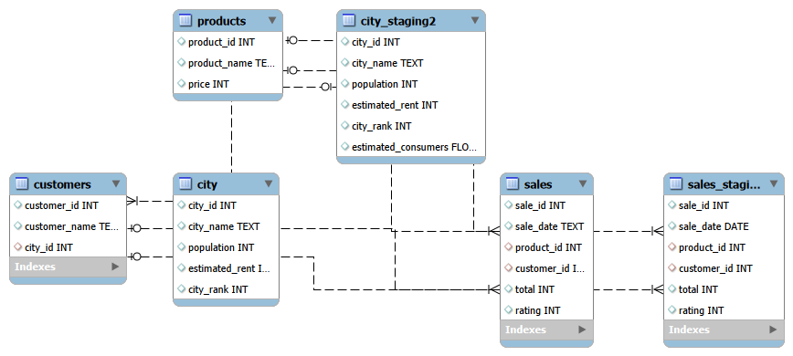

# ☕ Coffee Sales Analysis – Espansione Retail

Questo progetto analizza i dati di vendita degli ultimi 22 mesi di un'azienda produttrice di caffè. L'obiettivo dell'analisi è identificare i trend commerciali, il comportamento dei consumatori e **consigliare le 3 migliori località strategiche** per l'apertura di un nuovo store fisico.

## 📊 Obiettivi del Progetto
* Analizzare il volume delle vendite e i ricavi su un arco temporale di quasi due anni.
* Identificare i prodotti più venduti.
* Individuare le città con la spesa media più alta.
* Formulare una raccomandazione basata sui dati per l'apertura di 3 nuovi punti vendita.

## 🗄️ Struttura del Database (Schema E-R)
Il database è composto da tabelle relazionali che collegano le vendite, i prodotti, i clienti e le città.

 


## 🚀 Query Principali
Di seguito sono riportate alcune delle query SQL chiave utilizzate per estrarre i dati decisionali:

### 1. Importo medio delle vendite per cliente in ciascuna città
Utilizzata per capire quali sono le città in cui i clienti spendono di più.
```sql
#Creo una tabella temporanea con il numero totale di clienti per città
CREATE TEMPORARY TABLE total_cust
(
	city_id INT PRIMARY KEY,
    custom_per_city INT
);
INSERT INTO total_cust
SELECT city_id, COUNT(city_id) AS custom_per_city
FROM customers
GROUP BY city_id;

#Creo una tabella temporanea con il ricavato totale delle vendite in ogni città
CREATE TEMPORARY TABLE total_sales
(
	city_id INT PRIMARY KEY,
    sales_per_city INT
);
INSERT INTO total_sales
SELECT city_id, SUM(total) AS sales_per_city
FROM sales_staging s
LEFT JOIN customers c ON c.customer_id = s.customer_id
GROUP BY city_id;

SELECT s.city_id, city_name, ROUND((sales_per_city/custom_per_city),2) AS avg_sales_per_cust_per_city
FROM total_sales s
LEFT JOIN total_cust c ON s.city_id = c.city_id
LEFT JOIN city ON city.city_id = s.city_id
ORDER BY avg_sales_per_cust_per_city DESC;
```

### 2. Confronto tra spesa media e affitto per città
Utilizzata per confrontare l'entrata dalle vendite con il costo dell'affitto dei locali.
```sql
WITH fatturato_per_citta AS
(
	SELECT customers.city_id, city_name, SUM(sales_staging.total) AS fatturato
	FROM customers
	LEFT JOIN city ON customers.city_id = city.city_id
	LEFT JOIN sales_staging ON sales_staging.customer_id = customers.customer_id
	GROUP BY city_id, city_name
	ORDER BY fatturato DESC
), 
clienti_unici AS
(
	WITH tab1 AS
	(
	SELECT s.customer_id, c.city_name
	FROM sales s
	LEFT JOIN customers cust ON cust.customer_id = s.customer_id
	LEFT JOIN city c ON cust.city_id = c.city_id
	GROUP BY s.customer_id, c.city_name
	)
	SELECT city_name, COUNT(city_name) AS cl_unici
	FROM tab1
	GROUP BY city_name
)
SELECT fatturato_per_citta.city_name, cl_unici, fatturato, estimated_rent,
ROUND((fatturato/cl_unici),2) AS spesa_media_per_cliente, 
ROUND((estimated_rent/cl_unici),2) AS costo_medio_affitto_per_cl
FROM fatturato_per_citta
LEFT JOIN clienti_unici ON fatturato_per_citta.city_name = clienti_unici.city_name
LEFT JOIN city ON city.city_name = clienti_unici.city_name
ORDER BY 5 DESC;
```

## 🎯 Conclusioni e Raccomandazioni (I 3 Nuovi Store)
Basandosi sull'analisi svolta, i tre luoghi consigliati per l'espansione sono:
1. **Pune** – E' la città con fatturato più alto (1258290) e inoltre la spesa media per cliente (24197) è parecchio più alta rispetto al costo medio dell'affitto per cliente (294).
2. **Delhi** – E' la città con la stima più alta di consumatori di caffè (7,75 mln) e il costo medio dell'affitto per cliente resta basso (330).
3. **Chennai** – E' la seconda città che ha fatturato di più (944120) e la spesa media per cliente (22479) è parecchio più alta rispetto al costo medio dell'affitto per cliente (407).

## 🛠️ Tecnologie Utilizzate
* **Database:** MySQL 8.0
* **Strumenti:** MySQL Workbench / DBeaver
* **Tecniche SQL:** JOIN complesse, Funzioni di aggregazione (SUM, AVG, COUNT), Raggruppamenti (GROUP BY), Tabelle temporanee.
